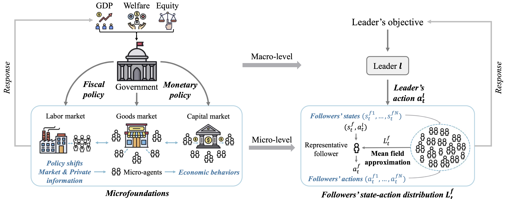
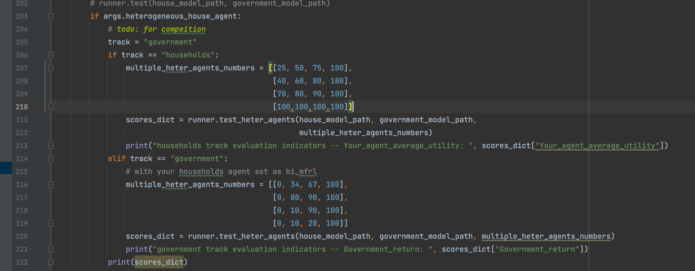

# Learning Macroeconomic Policies based on Microfoundations: A Dynamic Stackelberg Mean Field Game Approach

<div style="text-align:center">
  
  <figcaption style="text-align:center;"></figcaption>
</div>

Effective macroeconomic policies play a crucial role in promoting economic growth and social stability. This paper models the optimal macroeconomic policy problem based on the \textit{Stackelberg Mean Field Game} (SMFG), where the government acts as the leader in policy-making, and large-scale households dynamically respond as followers. This modeling method captures the asymmetric dynamic game between the government and large-scale households, and interpretably evaluates the effects of macroeconomic policies based on microfoundations, which is difficult for existing methods to achieve. We also propose a solution for SMFGs, incorporating pre-training on real data and a model-free \textit{Stackelberg mean-field reinforcement learning }(SMFRL) algorithm, which operates independently of prior environmental knowledge and transitions. Our experimental results showcase the superiority of the SMFG method over other economic policies in terms of performance, efficiency-equity tradeoff, and SMFG assumption analysis. This paper significantly contributes to the domain of AI for economics by providing a powerful tool for modeling and solving optimal macroeconomic policies.

The **code** can be applied to various government policies and households' policies within the [TaxAI](https://github.com/jidiai/TaxAI) environment.

## Install

You can use any tool to manage your python environment. Here, we use conda as an example.

1. Install conda/miniconda.

2. Build a Python virtual environment.

```bash
conda create -n smfg python=3.8
```

3. Activate the virtual environment

```bash
conda activate smfg
```

4. Install [Pytorch](https://pytorch.org/).

5. Clone the repository and install the required dependencies

```bash 
cd SMFG
pip install -r requirements.txt
```
6. Install mpi4py
```bash 
conda install mpi4py
```


## Train agents

### SMFG method

```bash
python main.py --n_households 100 --house_alg "bi_mfrl" --gov_alg "bi_ddpg" --task "gdp" --seed 1 --hidden_size 128 --q_lr 3e-4 --p_lr 3e-4 --batch_size 128 
```
**Useful Arguments:**

- `--n_households`: Specifies the number of households. Options include 10, 100, 1000, or 10000.
- `--wandb`: Enables the use of *Weights & Biases* for logging data. You must create and set up your account to use this feature.
- `--bc`: Use behavior cloning for pre-training initialization.
- `--br`: Calculate and print the exploitability. This can slow down training and is generally used during testing.
- `--test`: Add this option if you wish to run tests.

These options help you configure and understand the performance of the system under different conditions.


### Ablation studies
1. SMFG-S
```bash
python main.py --n_households 100 --house_alg "mfrl" --gov_alg "ddpg" --task "gdp" --seed 8 --hidden_size 128 --q_lr 3e-4 --p_lr 3e-4 --batch_size 128 
```

2. SMFG-MF
```bash
python main.py --n_households 100 --house_alg "maddpg" --gov_alg "maddpg" --task "gdp" --seed 112 --hidden_size 128 --q_lr 3e-4 --p_lr 3e-4 --batch_size 128 
```

3. SMFG-S-MF
```bash
python main.py --n_households 100 --house_alg "ddpg" --gov_alg "ddpg" --task "gdp" --seed 8 --hidden_size 128 --q_lr 3e-4 --p_lr 3e-4 --batch_size 128 
```

4. Others

```bash
python main.py --n_households 100 --house_alg "real" --gov_alg "ddpg" --task "gdp" --seed 8 --hidden_size 128 --q_lr 3e-4 --p_lr 3e-4 --batch_size 128 
```

### Economic policies

1. Free Market: A market without policy intervention.

```bash
python main.py --n_households 100 --house_alg "real" --gov_alg "rule_based" --task "gdp" --seed 112 --hidden_size 128 --q_lr 3e-4 --p_lr 3e-4 --batch_size 128 
```

2. Saez Tax: The Saex tax policy is often considered a suggestion for specific tax reforms in the real world.

```bash
python main.py --n_households 100 --house_alg "real" --gov_alg "saez" --task "gdp" --seed 112 --hidden_size 128 --q_lr 3e-4 --p_lr 3e-4 --batch_size 128 
```

3. U.S. Federal Tax: Real data from OECD in 2022 for this policy.

```bash
python main.py --n_households 100 --house_alg "real" --gov_alg "us_federal" --task "gdp" --seed 112 --hidden_size 128 --q_lr 3e-4 --p_lr 3e-4 --batch_size 128
```

4. AI Economist: This is a two-level MARL method based on Proximal Policy Optimization (PPO). In the first phase, households' policies are trained from scratch in a free-market (no-tax) environment. In the second phase, households continue to learn under an RL social planner.

```bash
python main.py --n_households 100 --house_alg "aie" --gov_alg "aie" --task "gdp" --seed 112 --hidden_size 128 --q_lr 3e-4 --p_lr 3e-4 --batch_size 128 
```

5. AI Economist-BC: For fairness in comparison, we evaluated the AI Economist method with behavior cloning as pre-training to determine its effectiveness.

```bash
python main.py --n_households 100 --house_alg "aie_bc" --gov_alg "aie" --task "gdp" --seed 112 --hidden_size 128 --q_lr 3e-4 --p_lr 3e-4 --batch_size 128 
```


## Test trained policy
Add "--test" as follows.
```bash
python main.py --n_households 100 --house_alg "bi_mfrl" --gov_alg "bi_ddpg" --task "gdp" --seed 1 --hidden_size 128 --q_lr 3e-4 --p_lr 3e-4 --batch_size 128 --test
```


## Competition
```bash
python main.py --n_households 100 --house_alg "bi_mfrl" --gov_alg "ddpg" --task "gdp" --seed 1 --hidden_size 128 --q_lr 3e-4 --p_lr 3e-4 --batch_size 128 --test --heterogeneous_house_agent
```
### 1. Households track:
我们预定义三种 households 策略在竞赛仿真器中，让选手提交的 policy 和我们预定义的 policy 进行比较，这样不同的households policy 形成本比赛核心—— “heterogeneous agent model”。

预定义的 households policy 包括：
- "bi_mfrl"：(SMFRL policy proposed by Mi. 2024)，which can respond to government's action.
- "real": (behavior cloning policy), 基于真实数据进行 behavior cloning 得到；
- "rule_based": 本质上是 random policy，代表现实社会大部分人的行为习惯。

预定义的 government policy 包括：
- "bi_ddpg"

在Households track，我们设置了不同的heterogeneous agents （用户提交 policy 和 预定义的 households policy）的组成比例，并使用 "Your_agent_average_utility" 作为评估指，代表用户提交策略最终计算的 utility 的平均值。

因此，测试 households track 的指令是,请填充 **'agents/submission.py'**:
```bash
python main.py --n_households 100 --house_alg "your_policy" --gov_alg "ddpg" --task "gdp" --seed 1 --hidden_size 128 --q_lr 3e-4 --p_lr 3e-4 --batch_size 128 --test --heterogeneous_house_agent
```
假如你的 policy 是 "bi_mfrl", 就将"your_policy"设置为 "bi_mfrl"。否则，需要用户来填充**'agents/submission.py'**，从而完成 "your_policy"的内容。

### 2. Government track:
预定义的 households policy 与 households track 相同，government policy 由用户提交。

同样，在 Government track，我们也设置了不同的 heterogeneous agents 的组成比例，并使用 "Government_return" 作为评估指，代表用户提交策略最终计算的 government return 的平均值。

因此，测试 Government track 的指令如下,请填充 **'agents/submission.py'**:
```bash
python main.py --n_households 100 --house_alg "bi_mfrl" --gov_alg "your_policy" --task "gdp" --seed 1 --hidden_size 128 --q_lr 3e-4 --p_lr 3e-4 --batch_size 128 --test --heterogeneous_house_agent
```

实现细节参见 main.py 如下：

## Acknowledgement

[TaxAI](https://github.com/jidiai/TaxAI)

